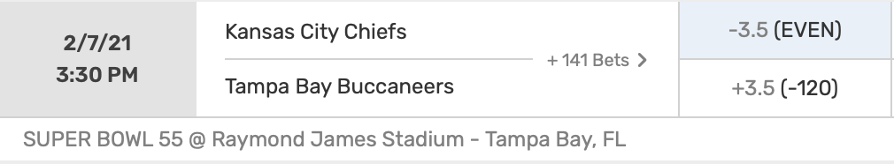
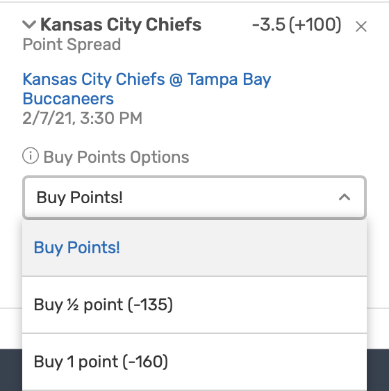

```{r setup, include=FALSE}
knitr::opts_chunk$set(echo = TRUE)
library(readr)
library(ggplot2)
library(dplyr)
library(tidyr)
```

# Why You Shouldn't Buy Points for Super Bowl 2021.

### Understanding the Question.

In 2021, we have been blessed with the Super Bowl matchup of our dreams, `G.O.A.T. Brady vs. God Mahomes`. The opening line on Bovada is Chiefs -3.5 (+100) and Bucs +3.5 (-120), as shown in the screenshot below.

<center>
{width=450px}
</center>

This corresponds to the following profit chart.
<center>
| |Chiefs Cover -3.5|Bucs Cover +3.5|
|--------|-------|-------|
|__Bet $\$B$ on Chiefs -3.5 (+100)__| $+B$ | $-B$ |
|__Bet $\$B$ on Bucs +3.5 (-120)__| $-B$  | $+B\cdot\frac{100}{120} = +.83B$  |
</center>

I'll be betting on the Chiefs because clearly they're the better team, and I'll take a 25 year-old Mahomes over a 43 year-old Brady. However, the -3.5 line gives me pause, because 3 points is the most common margin of victory in the NFL, and I don't want to lose my bet via the Chiefs' winning the Super Bowl by 3. So, Bovada provides some alternatives: I can "buy points". In other words, Bovada has alternative lines, including the Chiefs -3 (-135) and the Chiefs -2.5 (-160), as indicated by the screenshot below.

<center>
{width=240px}
</center>

So, is it worth it to pay the stiff juice of a $-135$ or $-160$ moneyline to avoid despair if the Chiefs win by a field goal?

### Probability Model.

Let $X_0$ be the random variable denoting the profit from betting $\$B$ on the original line, Chiefs -3.5 (+100):

$$
 X_0 =  \begin{cases}
    +B & \text{if Chiefs win by } \geq 4 \\
    -B & \text{else}. \\
  \end{cases}
$$

Let $X_{1/2}$ denote the profit from betting $\$B$ on the "buy $1/2$ point" line, Chiefs -3 (-135):

$$
 X_{1/2} =  \begin{cases} 
  +\frac{100}{135}B & \text{if Chiefs win by } \geq 4 \\
    0 & \text{if Chiefs win by exactly } 3 \\
    -B & \text{else}. \\
  \end{cases}
$$

Let $X_1$ denote the profit from betting $\$B$ on the "buy $1$ point" line, Chiefs -2.5 (-160):

$$
 X_1 =  \begin{cases} 
  +\frac{100}{160}B & \text{if Chiefs win by } \geq 3 \\
    -B & \text{else}. \\
  \end{cases}
$$

To make the model more explicit, we introduce 2 parameters. Let $p$ denote the probability that the Chiefs win by $\geq 4$ points, and let $q$ denote the probability that the Chiefs win by exactly $3$ points. Then

$$
 X_0 =  \begin{cases}
    +B & \text{with probability } p \\
    -B & \text{with probability } 1-p
  \end{cases}
$$

$$
 X_{1/2} =  \begin{cases} 
  +\frac{100}{135}B & \text{with probability } p \\
    0 & \text{with probability } q \\
    -B & \text{with probability } 1-p-q \\
  \end{cases}
$$

$$
 X_1 =  \begin{cases} 
  +\frac{100}{160}B & \text{with probability } p+q \\
    -B & \text{with probability } 1-p-q. \\
  \end{cases}
$$

The most profitable strategy has the highest expected profit. So, we will compare $\mathbb{E}X_0,\mathbb{E}X_{1/2},\text{ and }\mathbb{E}X_1$, and choose the strategy with the highest such value. Well,

$$
\begin{aligned}
\mathbb{E}X_0 &= B(p) - B(1-p) \\ &= B(2p-1)\\ \\
\mathbb{E}X_{1/2} &= B(\frac{100}{135}p) - B(1-p-q) \\ &= B(\frac{47}{27}p + q - 1) \\ \\
\mathbb{E}X_1 &= B(\frac{100}{160}(p+q)) - B(1-p-q) \\ &= B(\frac{13}{8}p+\frac{13}{8}q-1).
\end{aligned}
$$

Now, we need only calculate $p$ and $q$.

### Estimating $p$ and $q$.

Given that the Chiefs are a $3.5$ point favorite, $p$ is the probability that the Chiefs win by $\geq 4$ points, and $q$ is the probability that the Chiefs win by exactly $3$ points. Our task is to estimate $p$ and $q$.

I found a dataset containing the opening and closing pointspreads from every NFL game during the last 10 years, ending with NFL Week 14, 2020. Here is a peek at the head of the dataset, showing the some of the Week 14 results.


```{r, comment=NA, echo=FALSE, R.options = list(width = 200)}
d <- read.csv("nfl.csv") %>% select("Date", "Away.Team","Home.Team", "Away.Score","Home.Score", "Home.Line.Open", "Home.Line.Close")
colnames(d) <- c("date","away.team","home.team","away.score","home.score","home.line.open", "home.line.close")

extract.last.word <- function(v) {
  result <- c()
  for (s in v) {
    result <- c(result, tail(strsplit(s,split=" ")[[1]],1))
  }
  result
}

d$home.team <- extract.last.word(d$home.team)
d$away.team <- extract.last.word(d$away.team)

head(d,4)
```


Now, we narrow the dataset to include only the games that had an opening or closing pointspread of $3.5$. Then, we modify the dataset to include 2 new columns: `fave.covers`, which is `TRUE` iff the favorite covered the $-3.5$ spread, and `exactly.3`, which is `TRUE` iff the final score ended in the favorite winning by exactly 3 points. Here is a peek at the head of the updated dataset, omiting the column `home.line.close` to save space for aesthetics.

```{r, comment=NA, echo=FALSE, R.options = list(width = 200)}
d <- d %>% mutate(home.margin = home.score - away.score)

df <- d %>% filter(home.line.open == -3.5 | home.line.close == -3.5) # -3.5 home favorites
du <- d %>% filter(home.line.open == 3.5 | home.line.close == 3.5 ) # -3.5 away favorites

df <- df %>% mutate(fave.covers = home.margin >  3.5) %>% mutate(exactly.3 = home.margin == 3)
du <- du %>% mutate(fave.covers = home.margin < -3.5) %>% mutate(exactly.3 = home.margin == -3)

# new dataset
d2 <- rbind(df,du)
d2 <- d2[ rev(order(as.Date(d2$date, format="%Y-%m-%d"))), ]
d2$home.margin <- NULL
d2$home.line.close <- NULL
head(d2,6)

# calculate p and q
p = round(sum(d2$fave.covers)/length(d2$fave.covers),2)
q = round(sum(d2$exactly.3)/length(d2$exactly.3),2)
```

Interestingly, as shown above, the Chiefs and Bucs met earlier in the season, on November 29, 2020. The Chiefs were also $3.5$ point favorites then, and they won by exactly 3 points! Spooky!

Now, we estimate $p$, the probability that a $-3.5$ point favorite covers the spread, and $q$, the probability that a $-3.5$ point favorite wins by exactly 3 points, by the empirical proportions from our dataset. Hence

$$p = `r p`$$

and 

$$q = `r q`.$$

Finally, note that our dataset of games having a pointspread of $3.5$ contains $`r nrow(d2)`$ games, which is a nice sample size, enough to give us some confidence in our estimates for $p$ and $q$.

### Conclusion.

As calculated previously,

$$
\begin{cases}
\mathbb{E}X_0 = B(2p-1)\\ 
\mathbb{E}X_{1/2} = B(\frac{47}{27}p + q - 1) \\
\mathbb{E}X_1 = B(\frac{13}{8}p+\frac{13}{8}q-1).
\end{cases}
$$


```{r, echo=FALSE}
B <- 50

e0m = 2*p-1
e12m = 47/27*p + q - 1
e1m = 13/8*p + 13/8*q - 1

e0 = B*e0m
e12 = B*e12m
e1 = B*e1m
```

Using $p = `r p`$ and $q = `r q`$, we get

$$
\begin{cases}
\mathbb{E}X_0 = `r round(e0m,2)`B \\ 
\mathbb{E}X_{1/2} = `r round(e12m,2)`B \\ 
\mathbb{E}X_1 = `r round(e1m,2)`B.
\end{cases}
$$


To make this calculation more concrete, we choose a value for $B$. Since Ryan Brill and his buddy Nick Miller made $\$ 50$ worth of NFL bets each week on the 2020 edition of the [Bet, Sweat, and Forget Podcast](https://ryansbrill.com/bsf/), we shall use $B =50$, yielding 

$$
\begin{cases}
\mathbb{E}X_0 = `r round(e0,2)` \\ 
\mathbb{E}X_{1/2} = `r round(e12,2)` \\ 
\mathbb{E}X_1 = `r round(e1,2)`.
\end{cases}
$$

So, betting the original line is the most profitable strategy, because its expected profit is the least negative. In fact, betting $\$50$ and not buying points saves you at least $\$ `r abs(round(e0,2) - round(e12,2))`$ on average. 

##### Hence it is more profitable on average _not_ to buy points, no matter how tempting it may seem!

### More General Moneylines. 

More generally, we suppose that the original pointspread has a moneyline of $-M_0$ for the favorite, the "buy a half point" spread has a moneyline of $-M_{1/2}$, and the "buy a point" spread has a moneyline of $-M_1$. Suppose we bet $\$ B$. Let $p$ be the probability that the favorite covers in the original bet, and let $q$ be the probability that the final game score is exactly the pointspread in the "buy a half point" bet. Then the profits $X_0, X_{1/2}, \text{ and } X_1$ of betting on the respective pointspreads are 

$$
 X_0 =  \begin{cases}
    +B\frac{100}{M_0} & \text{with probability } p \\
    -B & \text{with probability } 1-p
  \end{cases}
$$

$$
 X_{1/2} =  \begin{cases} 
  +\frac{100}{M_{1/2}}B & \text{with probability } p \\
    0 & \text{with probability } q \\
    -B & \text{with probability } 1-p-q \\
  \end{cases}
$$

$$
 X_1 =  \begin{cases} 
  +\frac{100}{M_1}B & \text{with probability } p+q \\
    -B & \text{with probability } 1-p-q. \\
  \end{cases}
$$

The expected profits are thus

$$
\begin{cases}
\mathbb{E}X_0 = B\frac{100}{M_0} p - B (1-p) \\
\mathbb{E}X_{1/2} = B\frac{100}{M_{1/2}} p -B (1-p-q)\\
\mathbb{E}X_1 = B\frac{100}{M_1} (p+q) -B (1-p-q). \\
\end{cases}
$$

The most profitable strategy has the highest expected profit.

