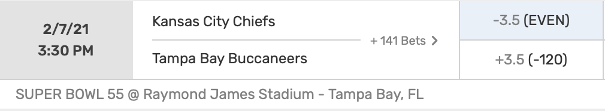
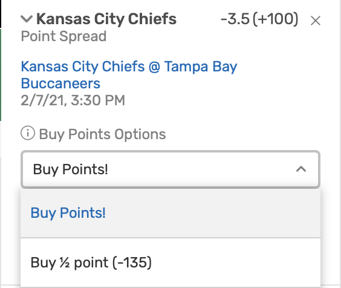

```{r setup, include=FALSE}
knitr::opts_chunk$set(echo = TRUE)
library(readr)
library(ggplot2)
library(dplyr)
library(tidyr)
```

# Why You Shouldn't Buy a Half Point for Super Bowl 2021.

### Understanding the Question.

In 2021, we have been blessed with the Super Bowl matchup of our dreams, `G.O.A.T. Brady vs. God Mahomes`. The opening line on Bovada is Chiefs -3.5 (+100) and Bucs +3.5 (-120), as shown in the screenshot below.

<center>
{width=450px}
</center>

This corresponds to the following profit chart.
<center>
| |Chiefs Cover -3.5|Bucs Cover +3.5|
|--------|-------|-------|
|__Bet $\$B$ on Chiefs -3.5 (+100)__| $+B$ | $-B$ |
|__Bet $\$B$ on Bucs +3.5 (-120)__| $-B$  | $+B\cdot\frac{100}{120} = +.83B$  |
</center>

I'll be betting on the Chiefs because clearly they're the better team, and I'll take a 25 year-old Mahomes over a 43 year-old Brady. However, the -3.5 line gives me pause, because 3 points is the most common margin of victory in the NFL, and I don't want to lose my bet via the Chiefs' winning the Super Bowl by 3. So, Bovada provides an alternative option: I can "buy a half point". In other words, Bovada has an alternative line, Chiefs -3 (-135), as indicated by the screenshot below.

<center>
{width=270px}
</center>

Buying a half point corresponds to the following profit chart.

<center>
| |Chiefs Cover -3|Bucs Cover +3|Chiefs win by Exactly 3|
|--------|-------|-------|----|
|__Bet $\$B$ on Chiefs -3 (-135)__| $+B\cdot\frac{100}{135} = +.74B$ | $-B$ | $0$ |
</center>

So, is it worth it to pay the stiff juice of a $-135$ moneyline to avoid despair if the Chiefs win by a field goal?

### Probability Model.

There are 2 strategies for betting on the Chiefs: 

1. betting on the original line Chiefs $-3.5 \ (+100)$ 
2. buying a half point to get the line Chiefs $-3 \ (-135)$. 

Let the profit from betting $\$B$ on the original line be the random variable $X_0$, and let the profit from betting $\$B$ on the alternative line be the random variable $X_a$, given by

$$
 X_0 =  \begin{cases}
    +B & \text{if Chiefs win by } \geq 4 \\
    -B & \text{else} \\
  \end{cases}
$$

$$
 X_a =  \begin{cases} 
  +\frac{100}{135}B & \text{if Chiefs win by } \geq 4 \\
    0 & \text{if Chiefs win by exactly } 3 \\
    -B & \text{else}. \\
  \end{cases}
$$

To make the model more explicit, we introduce 2 parameters. Let $p$ denote the probability that the Chiefs win by $\geq 4$ points, and let $q$ denote the probability that the Chiefs win by exactly $3$ points. Then

$$
 X_0 =  \begin{cases}
    +B & \text{with probability } p \\
    -B & \text{with probability } 1-p
  \end{cases}
$$

$$
 X_a =  \begin{cases} 
  +\frac{100}{135}B & \text{with probability } p \\
    0 & \text{with probability } q \\
    -B & \text{with probability } 1-p-q. \\
  \end{cases}
$$

A strategy is more profitable if it has a higher expected profit. In other words, we buy a half point if and only if

$$\mathbb{E}X_a - \mathbb{E}X_0 > 0.$$

Well,

$$
\begin{aligned}
\mathbb{E}X_a - \mathbb{E}X_0 &= \bigg(B\frac{100}{135}p - B(1-p-q)\bigg) - \bigg(Bp - B(1-p)\bigg) \\
&= B\bigg((\frac{235}{135}p + q - 1) - (2p-1) \bigg) \\
&= B\bigg(q - \frac{35}{135}p \bigg) \\
&= B\bigg(q - \frac{7}{27}p \bigg). \\
\end{aligned}
$$

Therefore, we buy a half point if and only if $\mathbb{E}X_a - \mathbb{E}X_0 > 0$ iff

$$q > \frac{7}{27}p.$$

Hence we need only calculate $p$ and $q$.

### Calculating $p$ and $q$.

Given that the Chiefs are a $3.5$ point favorite, $p$ is the probability that the Chiefs win by $\geq 4$ points, and $q$ is the probability that the Chiefs win by exactly $3$ points. Our task is to estimate $p$ and $q$.

I found a dataset containing the opening and closing pointspreads from every NFL game during the last 10 years, ending with NFL Week 14, 2020. Here is a peak at the head of the dataset, showing the some of the Week 14 results.


```{r, comment=NA, echo=FALSE, R.options = list(width = 200)}
d <- read.csv("nfl.csv") %>% select("Date", "Away.Team","Home.Team", "Away.Score","Home.Score", "Home.Line.Open", "Home.Line.Close")
colnames(d) <- c("date","away.team","home.team","away.score","home.score","home.line.open", "home.line.close")

extract.last.word <- function(v) {
  result <- c()
  for (s in v) {
    result <- c(result, tail(strsplit(s,split=" ")[[1]],1))
  }
  result
}

d$home.team <- extract.last.word(d$home.team)
d$away.team <- extract.last.word(d$away.team)

head(d,4)
```


Now, we narrow the dataset to include only the games that had an opening or closing pointspread of $3.5$. Then, we modify the dataset to include 2 new columns: `fave.covers`, which is `TRUE` iff the favorite covered the $-3.5$ spread, and `exactly.3`, which is `TRUE` iff the final score ended in the favorite winning by exactly 3 points. Here is a peak at the head of the updated dataset.

```{r, comment=NA, echo=FALSE, R.options = list(width = 200)}
d <- d %>% mutate(home.margin = home.score - away.score)

df <- d %>% filter(home.line.open == -3.5 | home.line.close == -3.5) # -3.5 home favorites
du <- d %>% filter(home.line.open == 3.5 | home.line.close == 3.5 ) # -3.5 away favorites

df <- df %>% mutate(fave.covers = home.margin >  3.5) %>% mutate(exactly.3 = home.margin == 3)
du <- du %>% mutate(fave.covers = home.margin < -3.5) %>% mutate(exactly.3 = home.margin == -3)


# new dataset
d2 <- rbind(df,du)
d2 <- d2[ rev(order(as.Date(d2$date, format="%Y-%m-%d"))), ]
d2$home.margin <- NULL
head(d2,6)

# calculate p and q
p = round(sum(d2$fave.covers)/length(d2$fave.covers),2)
q = round(sum(d2$exactly.3)/length(d2$exactly.3),2)
```

Interestingly, as shown above, the Chiefs and Bucs met earlier in the season, on November 29, 2020. The Chiefs were also $3.5$ point favorites then, and they won by exactly 3 points! Spooky!

Now, we estimate $p$, the probability that a $-3.5$ point favorite covers the spread, and $q$, the probability that a $-3.5$ point favorite wins by exactly 3 points, by the empirical proportions from our dataset. Hence

$$p = `r p`$$

and 

$$q = `r q`.$$


Finally, note that our dataset of games having a pointspread of $3.5$ contains $`r nrow(d2)`$ games, which is a nice sample size, enough to give us some confidence in our estimates for $p$ and $q$.

### Conclusion.

As calculated previously,

$$
\mathbb{E}X_a - \mathbb{E}X_0 = B\bigg(q - \frac{7}{27}p \bigg).
$$

We just calculated $p = `r p`$ and $q = `r q`$. Furthermore, during each week of the 2020 NFL season, Ryan Brill and his buddy Nick Miller made $\$ 50$ worth of NFL bets on the [Bet, Sweat, and Forget Podcast](https://ryansbrill.com/bsf/), so we shall use a bet size of $B =50$. Hence


```{r, echo=FALSE}
B <- 50
exp.profit <- round(B*(q - 7/27*p),2)
```

$$
\mathbb{E}X_a - \mathbb{E}X_0 = `r exp.profit`.
$$

Since $\mathbb{E}X_a - \mathbb{E}X_0 < 0$, it is more profitable on average _not_ to buy a half point, no matter how tempting it may seem! 

### More General Moneylines. 

More generally, we suppose that the original pointspread has a moneyline of $-M_f$ for the favorite and $-M_u$ for the underdog. Also, suppose that the alternative "buy a half point" pointspread has a moneyline of $-m_f$ for the favorite and $-m_u$ for the underdog. Suppose we bet $\$ B$. Let $p$ be the probability that the favorite covers in the original bet, and let $q$ be the probability that the final game score is exactly the pointspread in the alternative bet. Then the profit $X_0$ of betting on the original pointspread, and the profit $X_a$ of betting on the alternative pointspread, are given by

$$
 X_0 =  \begin{cases}
    +B\frac{100}{M_f} & \text{with probability } p \\
    -B\frac{100}{M_u} & \text{with probability } 1-p
  \end{cases}
$$

$$
 X_a =  \begin{cases} 
  +B\frac{100}{m_f} & \text{with probability } p \\
    0 & \text{with probability } q \\
    -B\frac{100}{m_u} & \text{with probability } 1-p-q. \\
  \end{cases}
$$

Therefore,

$$
\begin{aligned}
\mathbb{E}X_a - \mathbb{E}X_0 
&= \bigg[B\frac{100}{m_f} p - B \frac{100}{m_u} (1-p-q)\bigg] - \bigg[ B\frac{100}{M_f} p - B \frac{100}{M_u}(1-p) \bigg] \\
&= 100B \bigg[p \bigg(\frac{1}{m_f} + \frac{1}{m_u} - \frac{1}{M_f} - \frac{1}{M_u} \bigg)+ \frac{1}{m_u}q +  \frac{1}{M_u} - \frac{1}{m_u}  \bigg].
\end{aligned}
$$

Buying a half point is profitable if and only if $\mathbb{E}X_a - \mathbb{E}X_0 > 0$.
