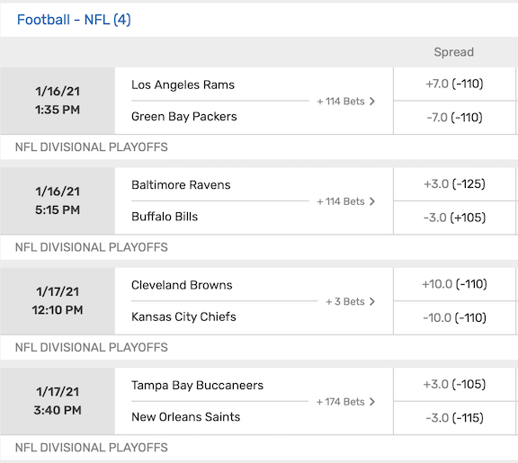
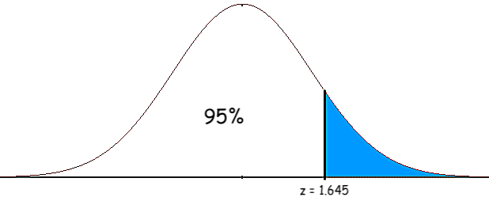

```{r setup, include=FALSE}
knitr::opts_chunk$set(echo = TRUE)
library(ggplot2)
library(tidyr)
```

# Are Ryan Brill and Nick Miller Better at Sports Betting than a Monkey?

Each week during the NFL season, Ryan Brill and his buddy Nick Miller make $50 worth of NFL bets on the [Bet, Sweat, and Forget Podcast](https://ryansbrill.com/bsf/). This begs the following question: __Are Ryan and Nick better gamblers than a "monkey throwing darts", i.e. someone who bets \$50 randomly each week?__

### Strategy: Conduct a Hypothesis Test

Assume a monkey's weekly profit is given by the null distribution, which has mean $\mu_0$ and variance $\sigma^2_0$, which are known constants, to be derived later. Also, suppose Ryan makes \$50 worth of NFL bets in each of $n$ weeks. This yields the data $X_1,...,X_n$, which are Ryan's $n$ profits for each week of betting. Assume the data $\{X_i\}_{i=1}^{n}$ are independently drawn from a distribution with unkown mean $\mu$ and known variance $\sigma^2_0$. To determine whether Ryan is better at gambling than a monkey, we shall determine whether Ryan's weekly profit mean $\mu$ is greater than a monkey's weekly profit mean $\mu_0$ with statistical significance. In other words, we conduct a hypothesis test:
\[
\begin{cases}
      \text{null hypothesis: } & \mu = \mu_0 \\
      \text{alternative hypothesis: } & \mu > \mu_0.
    \end{cases}
\]

Now, let $\overline{X} = (X_1+\cdots+X_n)/n$ be the empirical mean of Ryan's profits. Assuming that Ryan's profits follow the null distribution, i.e. that Ryan is no better at gambling than a monkey, the Central Limit Theorem then tells us that
$$Z := \frac{\overline{X}-\mu_0}{\sigma_0/\sqrt{n}} \approx \mathcal{N}(0,1).$$

Therefore, we use this value $Z$, the _z-score_, as our test statistic for the hypothesis test.

Then, using the mathematics of the $\mathcal{N}(0,1)$ probability density function, we compute a confidence interval $[a,b]$ such that if Ryan's weekly profits follow the null distribution, his z-score $Z$ should lie inside $[a.b]$ with 95% confidence. If Ryan's observed z-score lies outside the 95% confidence interval, then it is unlikely to have come from the null distribution, and so we reject the null hypothesis, concluding that Ryan is better at gambling than a monkey with 95% statistical significance. Conversely, if Ryan's observed z-score lies inside the 95% confidence interval, then we do not reject the null hypothesis, and conclude than Ryan is not better at gambling than a monkey with 95% statistical significance.

To summarize, the steps for conducting our hypothesis test are:

1. Compute $\mu_0$ and $\sigma_0$, the mean and standard deviation of the random variable representing the weekly profit of a sports-betting monkey
2. Compile the data $X_1,...,X_n$, Ryan's $n$ weekly profits, and compute the empirical mean $\overline{X}$
3. Compute Ryan's z-score, $Z = \frac{\overline{X}-\mu_0}{\sigma_0/\sqrt{n}}$
4. Compute a Confidence Interval $[a,b]$
5. Conclude that Ryan is better at gambling than a monkey only if $Z \not\in [a,b]$

### Computing $\mu_0$ and $\sigma^2_0$

We model the weekly profit of a sports-betting monkey by a random variable with mean $\mu_0$ and variance $\sigma^2_0$, which we shall now determine. 

Suppose that each week, a monkey places $\$B$ worth of NFL bets. Suppose that these $\$B$ are split up into $N$ equally sized bets, so each bet is a wager of $\$ B/N$. Suppose these bets have an average (negative) moneyline of $-M$, so $M\geq 100$. Now, a "monkey throwing darts" is a common trope referring to an ignorant bettor whose results are determined entirely by chance. Such a monkey has a 50% chance of winning or losing any bet it makes. Therefore, each of a monkey's $N$ weekly profits are given by the random variables

$$
Y_1,...,Y_N \overset{iid}{\sim} \begin{cases}
    -\frac{B}{N} & \text{with probability } 1/2 \text{ (monkey loses its bet}) \\
    \frac{B}{N} \cdot \frac{100}{M} & \text{with probability } 1/2 \text{ (monkey wins its bet}).
  \end{cases}
$$

The monkey's total weekly profit is thus given by the random variable $Y:=Y_1+\cdots+Y_N$.

Therefore

$$\mu_0 := \mathbb{E}Y = N\cdot \mathbb{E}Y_1 = \frac{N}{2}\bigg(\frac{-B}{N} +  \frac{B}{N} \cdot \frac{100}{M} \bigg) = \frac{B\cdot(100-M)}{2M}$$

and 

$$\begin{aligned}
  \sigma_0^2(N) & :=\text{Var}(Y) \\
  &= \mathbb{E}Y^2 - (\mathbb{E}Y)^2 \\
  &= \sum_i \mathbb{E}Y^2_i + \sum_{i\neq j} \mathbb{E}Y_iY_j - \mu^2_0 \\
  &= N \cdot \mathbb{E}Y^2_1 + N(N-1)\cdot \mathbb{E}Y_1\mathbb{E}Y_2 - \mu^2_0 \\
  &= N \cdot \frac{1}{2}\bigg( \frac{B^2}{N^2} + \frac{B^2}{N^2}\cdot\frac{100^2}{M^2}\bigg) + N(N-1)\cdot \bigg( \frac{-B}{N} + \frac{B}{N}\cdot\frac{100}{M}\bigg)^2 - \mu^2_0 \\
  &= \frac{B^2}{2N}\bigg(\frac{100^2 + M^2}{M^2}\bigg) + \frac{B^2(N-1)}{N}\bigg(\frac{100-M}{M}\bigg)^2 - \mu^2_0 \\
  &= \frac{B^2}{N M^2} \big[(100^2+M^2)/2 + (N-1) (100-M)^2 \big] - \mu_0^2.
\end{aligned}$$

Now, the screenshot below, taken from an online casino, shows the pointspread bets from the 2021 divisional playoff round. This screenshot shows that it is reasonable to take $M=110$.

<center>
{width=450px}
</center>

Moreoever, during each week of the 2020 NFL season, Ryan Brill made $\$50$ worth of NFL bets on the [Bet, Sweat, and Forget Podcast](https://ryansbrill.com/bsf/), so we shall take $B=50$.

Thus, using $B=50$ and $M=110$, we get $\mu_0 =$

```{r,comment=NA, echo=FALSE}
B = 50
M = 110
mu_0 = B*(100-M)/(2*M)
mu_0
```

In other words, a monkey wagering $\$50$ profits $-\$2.27$ on average. This makes sense because our choice of $M=-110$ for the average moneyline indicates that sports betting should be slightly unprofitable.

Furthermore, it is interesting to note that the standard deviation $\sigma_0 = \sigma_0(N)$ of a monkey's weekly profit decreases as $N$ increases:

```{r, comment=NA, echo=FALSE}
sigma_Y <- function(N) {
  v = B^2/(N*M^2) * ((100^2+M^2)/2 + (N-1)*(100-M)^2) - mu_0^2
  sqrt(v)
}

NN = 10
x <- 1:NN
y <- sigma_Y(1:NN)
df <- data.frame(x,y)
ggplot(data = df) +
  geom_point(data = df, aes(x= df$x, y = df$y)) +
  geom_line(aes(x = df$x, y = df$y)) +
  labs(title = "", x = "number of bets N that a monkey places per week", y = "standard deviation of a monkey's weekly bets")
```

This makes sense because making 1 bet corresponds to "boom or bust" - either you hit the bet and make a lot of money, or you lose the bet and lose a lot of money, which corresponds to high variance. Conversely, making many bets - say, 10 bets - corresponds to lower variance since you have a good chance of hitting 3,4,5,6,or 7 bets, whose corresponding profits are closer to the mean, as oppossed to hitting 0,1,9, or 10 bets.

Now, looking at Ryan Brill and Nick Miller's betting data from the 2020 [Bet, Sweat, and Forget Podcast](https://ryansbrill.com/bsf/), we shall take $N=4$, which yields $\sigma_0 =$
```{r, comment=NA, echo=FALSE}
N = 4
sigma_0 = sigma_Y(N)
sigma_0
```

In conclusion, we shall be using  
$$\mu_0 = `r round(mu_0,2)` \qquad \text{and} \qquad \sigma_0 = `r round(sigma_0,2)`.$$


### Computing $\overline{X}$ and $Z$

Ryan Brill and Nick Millers' 2020 NFL betting data from the [Bet, Sweat, and Forget Podcast](https://ryansbrill.com/bsf/) are given below:

```{r, echo=FALSE, warning=FALSE, comment=NA}
ryan <- c(-7.09, -2.4, 8.47, 37.24, -4.75, -26.14, 55.84, -7.98, -5.99, -14.91, -12.97, 23.56, 1.98, -31.3, NA, -33.87, 5.52, 16.88)
nick <- c(35.83, 79.34, -11.39, 49.99, 20.5, 4.04, -2.83, -50, -50, -11.82, NA, NA, 22.81, -32.59, NA, 16.82, 5.58, NA)
```

```{r, echo=FALSE, warning=FALSE, comment=NA}
if (length(ryan) == length(nick)) {
  N = length(ryan)
  num_weeks <- 1:N
  df <- data.frame(nick, ryan, num_weeks)
  ggplot(data = df) +
  geom_point(aes(x = df$num_weeks, y = df$nick, color = "nick"), shape=17) +
  geom_point(aes(x = df$num_weeks, y = df$ryan, color = "ryan"), shape=7) +
  geom_line(aes(x = df$num_weeks, y = rep(0, N), color = "zero")) +
  scale_color_manual(values=c("red", "dodgerblue2", "gray65")) +
  labs(title = "Bet, Sweat, and Forget 2020 NFL Betting Results", x = "NFL Week Number", y = "Weekly Profit, USD", color="") +
  scale_x_continuous(breaks = num_weeks) +
  expand_limits(x = N+1, y = 0)
}
```

```{r, comment=NA, echo=FALSE}
x_bar_ryan = mean(ryan, na.rm = TRUE)
x_bar_nick = mean(nick, na.rm = TRUE)

n_ryan = length(ryan[!is.na(ryan)])
n_nick = length(nick[!is.na(nick)])

z <- function(x_bar, mu_0, sigma_0, n) {
  (x_bar - mu_0)/(sigma_0/sqrt(n))
}
z_ryan = round(z(x_bar_ryan, mu_0, sigma_0, n_ryan),3)
z_nick = round(z(x_bar_nick, mu_0, sigma_0, n_nick),3)
```

Ryan and Nicks' empirical means are given by
$$\overline{X}_{ryan} = `r round(x_bar_ryan,2)` \qquad \text{and} \qquad \overline{X}_{nick} = `r round(x_bar_nick,2)`.$$

We compute their z-scores via
$$Z = \frac{\overline{X}-\mu_0}{\sigma_0/\sqrt{n}},$$

so Ryan and Nicks' z-scores are given by
$$Z_{ryan} = `r round(z_ryan,2)` \qquad \text{and} \qquad Z_{nick} = `r round(x_bar_nick,2)`.$$

### Confidence Interval

Assume Ryan is no better at gambling than a monkey, i.e. that Ryan's weekly profit $X_i$ follows the monkey's null distribution with mean $\mu_0$ and variance $\sigma_0^2$. Then by the Central Limit Theorem, Ryan's z-score is approximately normal:

$$Z = \frac{\overline{X}-\mu_0}{\sigma_0/\sqrt{n}} \approx \mathcal{N}(0,1).$$

Now, the 95% quantile for the $\mathcal{N}(0,1)$ density function is
```{r, comment=NA}
round(qnorm(.95),3)
```

which means that 95% of the area under the normal curve is to the left of $z = `r round(qnorm(.95),3)`$:

<center>
{width=450px}
</center>

Therefore, under the null distribution, the z-score $Z$ lies in the following interval with probability .95:

$$[-\infty, `r round(qnorm(.95),3)`]$$

and so this interval is known as a _95% confidence interval_.

Both Ryan's z-score `r z_ryan` and Nick's z-score `r z_nick` lie inside the 95% confidence interval $[-\infty, `r round(qnorm(.95),3)`]$, so we fail to reject the null hypothesis for both Ryan and Nick at the 95% significance level. In other words, neither Ryan Brill nor Nick Miller are better at gambling than a monkey, at the 95% statistical significance level. 

The following chart illustrates confidence intervals at other significance levels:

| Confidence Level | Confidence Interval |
|---|---|
|85%|$[-\infty, `r round(qnorm(.85),3)`]$|
|90%|$[-\infty, `r round(qnorm(.9),3)`]$|
|95%|$[-\infty, `r round(qnorm(.95),3)`]$|
|97.5%|$[-\infty, `r round(qnorm(.975),3)`]$|
|99%| $[-\infty, `r round(qnorm(.99),3)`]$ |

At the 85% level, Nick's z-score lies outisde the 85% confidence interval, so we reject the null hypothesis and conclude Nick is better at sports betting than a monkey with 85% statistical significance.

### Conclusion

##### Despite hosting the [Bet, Sweat, and Forget Podcast](https://ryansbrill.com/bsf/) every week during the NFL season, Ryan Brill is not better at sports betting than a monkey who knows nothing about football, with any reasonable statistical significance. Depending on the significance level you choose to take, however, Nick Miller is better at sports betting than a monkey, with some statistical significance.

